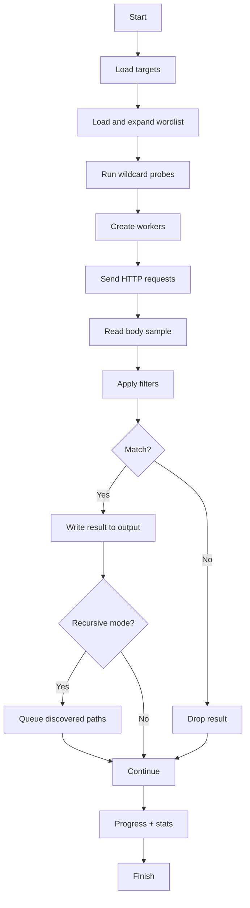

# <div align="center">⚡ godirsearch ⚡</div>

<div align="center">

[](https://github.com/AnggaTechI)


</div>

---

## <div align="center">🛰️ Overview</div>

**godirsearch** is a fast and modern **Go-based web path scanner** designed for efficient endpoint discovery on authorized targets.
It combines **concurrency, wildcard detection, adaptive rate control, recursive scanning, flexible filtering, proxy support, and multi-format reporting** in a lightweight CLI.

Built for people who want a scanner that feels clean, fast, and practical without becoming bloated.

---

## <div align="center">🔥 Highlights</div>

- ⚡ High-speed **concurrent scanning**
- 🎯 Supports **single target**, **target list**, and **CIDR range**
- 🧠 **Wildcard-aware detection** to reduce noisy false positives
- 🔁 **Recursive mode** with configurable depth and trigger statuses
- 🛡️ **Adaptive limiter** that reacts to `429` and `503`
- 🌐 **HTTP/2**, **custom headers**, **cookies**, **request body**, and **custom methods**
- 🕵️ **Rotating User-Agent** support
- 🔌 **Proxy** and **proxy-list rotation** support
- 🧩 Smart **wordlist expansion** with extensions, prefixes, suffixes, blacklist, and backup patterns
- 📊 Fine-grained **filtering system** for status, size, redirect, and body matching
- 📝 Export to **plain text**, **JSONL**, **CSV**, **HTML**, and **Markdown**
- ⏱️ Built-in **progress stats** and **graceful shutdown**

---

## <div align="center">🗂️ Project Structure</div>

```bash
.
├── cmd/
│   └── main.go
├── internal/
│   ├── filter/
│   │   ├── filter.go
│   │   └── parser.go
│   ├── output/
│   │   └── writer.go
│   ├── scanner/
│   │   ├── config.go
│   │   ├── ratelimit.go
│   │   ├── scanner.go
│   │   └── wildcard.go
│   └── wordlist/
│       └── wordlist.go
├── wordlists/
│   └── common.txt
└── go.mod
```

---

## <div align="center">🧠 Scan Flow</div>



---

## <div align="center">⚙️ Installation</div>

### Clone Repository

```bash
git clone https://github.com/AnggaTechI/godirsearch.git
cd godirsearch
```

### Requirements

- Go **1.20+** recommended

---

## <div align="center">🛠️ Build Guide</div>

### Build on Linux / macOS

```bash
go build -o godirsearch ./cmd
```

Run:

```bash
./godirsearch --version
```

---

### Build on Windows (CMD)

```bat
go build -o godirsearch.exe ./cmd
```

Run:

```bat
godirsearch.exe --version
```

---

### Build on Windows (PowerShell)

```powershell
go build -o godirsearch.exe ./cmd
```

Run:

```powershell
.\godirsearch.exe --version
```

---

### Optional stripped build

#### Linux / macOS

```bash
go build -ldflags="-s -w" -o godirsearch ./cmd
```

#### Windows

```bat
go build -ldflags="-s -w" -o godirsearch.exe ./cmd
```

---

## <div align="center">🚀 Usage</div>

### Single target

```bash
./godirsearch -u https://example.com -w wordlists/common.txt
```

### With extensions

```bash
./godirsearch -u https://example.com -w wordlists/common.txt -e php,html,js -f
```

### Target list

```bash
./godirsearch -l targets.txt -w wordlists/common.txt -t 50
```

### CIDR scan

```bash
./godirsearch --cidr 10.0.0.0/24 --scheme https -w wordlists/common.txt
```

### Recursive scan

```bash
./godirsearch -u https://example.com -w wordlists/common.txt -R --max-depth 3
```

### Multi-output scan

```bash
./godirsearch -u https://example.com -w wordlists/common.txt \
  -o results.txt -oj results.jsonl -oc results.csv -oh results.html -om results.md
```

---

## <div align="center">🧪 Advanced Examples</div>

### Custom headers and cookies

```bash
./godirsearch -u https://example.com -w wordlists/common.txt \
  -H "Authorization: Bearer TOKEN;;X-Test: 1" \
  -c "session=abc123"
```

### POST request with body

```bash
./godirsearch -u https://example.com/api -w wordlists/common.txt \
  --method POST -d '{"ping":"1"}'
```

### Proxy list rotation

```bash
./godirsearch -u https://example.com -w wordlists/common.txt --proxy-list proxies.txt
```

### Rotating user-agents

```bash
./godirsearch -u https://example.com -w wordlists/common.txt --random-agents --agents-file agents.txt
```

### Follow redirects

```bash
./godirsearch -u https://example.com -w wordlists/common.txt -r --max-redirects 5
```

### Quiet mode

```bash
./godirsearch -u https://example.com -w wordlists/common.txt -q
```

---

## <div align="center">🎛️ Useful Flags</div>

| Flag | Description |
|------|-------------|
| `-u` | Single target URL |
| `-l` | File containing target URLs |
| `--cidr` | CIDR range target input |
| `--scheme` | Default scheme for targets without scheme |
| `-w` | Wordlist file(s) |
| `-e` | Extensions |
| `-f` | Force extension expansion |
| `-O` | Overwrite existing extension |
| `--prefixes` | Prefix each entry |
| `--suffixes` | Suffix each entry |
| `--backup-patterns` | Generate backup-like variants |
| `-t` | Concurrent threads |
| `--timeout` | Request timeout |
| `--max-rate` | Max requests per second |
| `--delay` | Delay between requests |
| `--retries` | Retry count |
| `--max-time` | Max total runtime |
| `--method` | HTTP method |
| `--ua` | Custom User-Agent |
| `--random-agents` | Rotate User-Agents |
| `--agents-file` | File-based User-Agent pool |
| `-H` | Custom headers |
| `-c` | Cookie header |
| `-d` | Request body |
| `-r` | Follow redirects |
| `-s` | Include status |
| `--es` | Exclude status |
| `--exclude-size` | Exclude response sizes |
| `--exclude-text` | Exclude body text |
| `--exclude-regex` | Exclude body regex |
| `--exclude-redirect` | Exclude redirect regex |
| `--skip-on-status` | Abort on specific status |
| `-R` | Enable recursion |
| `--max-depth` | Maximum recursion depth |
| `--recursion-status` | Status codes that trigger recursion |
| `--force-recursive` | Recurse on all findings |
| `--subdirs` | Scan inside subdirectories |
| `-o` | Plain text output |
| `-oj` | JSONL output |
| `-oc` | CSV output |
| `-oh` | HTML report |
| `-om` | Markdown output |
| `--proxy` | Single proxy |
| `--proxy-list` | Proxy list |
| `--http2` | Enable HTTP/2 |
| `--tls-verify` | Verify TLS certificates |
| `-q` | Quiet mode |
| `--version` | Print version |

---

## <div align="center">📤 Output Formats</div>

`godirsearch` can write results into:

- **Plain text**
- **JSONL**
- **CSV**
- **HTML report**
- **Markdown report**

Example:

```bash
./godirsearch -u https://example.com -w wordlists/common.txt -oj out.jsonl -oh report.html
```

---

## <div align="center">🖥️ Sample Output</div>

```bash
[200] 512      https://example.com/admin
[301] 0        https://example.com/login -> https://example.com/login/
```

---

## <div align="center">📌 Internal Logic Summary</div>

- `cmd/main.go` handles flags, banner, progress output, and runtime flow
- `internal/wordlist` loads and expands wordlists
- `internal/filter` parses filters and decides whether results are reported or dropped
- `internal/scanner` handles workers, requests, recursion, wildcard probing, and adaptive rate limiting
- `internal/output` writes results into multiple formats

---

## <div align="center">⚠️ Notes</div>

- Use only on systems you own or are explicitly authorized to assess.
- Default behavior is designed to stay practical and reasonably controlled.
- TLS verification is optional for compatibility with self-signed targets.
- Wildcard detection can be tuned or disabled with `--wildcard-probes`.

---

## <div align="center">👤 Author</div>

<div align="center">

**AnggaTechI**  
GitHub: [github.com/AnggaTechI](https://github.com/AnggaTechI)

</div>

---

## <div align="center">⭐ Support</div>

<div align="center">
If this project helps you, drop a star on the repository and keep building cool things.
</div>
